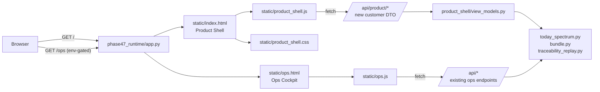
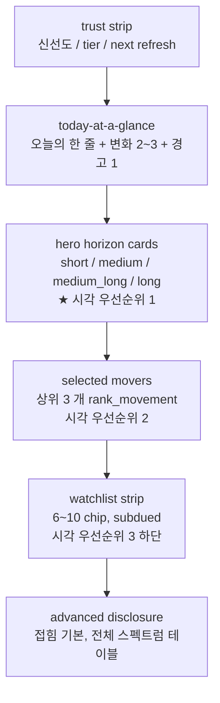
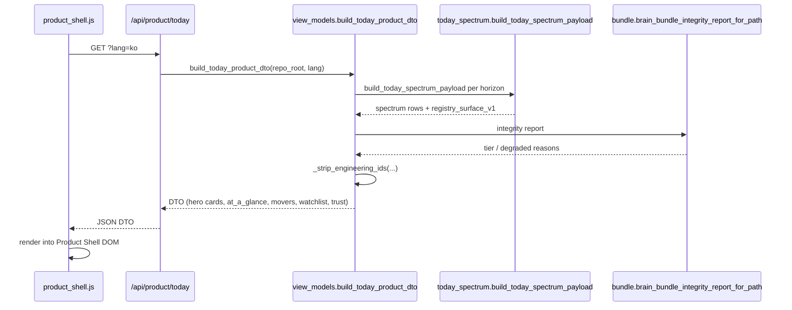

# METIS Product Shell Rebuild v1 — Patch 10A 실행 계획 (KR)

> 작성일: 2026-04-23
> 원본 워크오더: `METIS_Product_Shell_Rebuild_v1_Workorder_2026-04-23.md`
> 범위: **Patch 10A** (두 단계 중 1 단계)
> 10B 별도 플랜: Research / Replay / Ask AI 정식 재설계

---

## 0) 배경과 범위

워크오더를 2 개 패치로 쪼갠다.

- **Patch 10A (본 계획)**
  - 하드 스플릿 (Product Shell `/` vs Ops Cockpit `/ops`, env-gated)
  - Today 표면 정식 재설계 (trust strip + at-a-glance + **hero horizon 4-card** + movers + watchlist + disclosure)
  - 언어 계약 (엔지니어링 ID 누출 금지 + honest degraded 언어 + KO/EN parity)
  - 비주얼 시스템 베이스 (design tokens + 8 우선 컴포넌트 CSS)
  - mapper 층 (`build_today_product_dto`) + 신규 `/api/product/today`
  - Research / Replay / Ask AI 는 **"10B 정식 재설계 예정"** 스텁 카드로 유지 (제품 톤)
- **Patch 10B (별도)**
  - Research (claim rail + evidence rail + action rail + disclosure)
  - Replay (timeline-first + 시나리오 카드 + "what we knew then")
  - Ask AI (quick actions + context block + bounded free-text + recent requests)

엔진/백엔드 계약은 그대로. 새 mapper 와 DTO 로 **번역 층** 을 덧대는 구조.

---

## 1) 아키텍처 — 하드 2-파일 분리

### 1.1 라우팅과 파일 분리



**결정**:

- `/` 는 Product Shell 만. 고객 nav = Today / Research / Replay / Ask AI (4 개).
- `/ops` 는 환경 변수 `METIS_OPS_SHELL=1` 없으면 **404**. 있으면 기존 Cockpit 그대로 (Home / Watchlist / Research / Replay / Ask AI / Journal / Advanced).
- 기존 `static/index.html` + `static/app.js` 는 **rename** → `static/ops.html` + `static/ops.js`. 삭제 아님.
- 신규 Product Shell 파일은 처음부터 분리 작성. 기존 렌더러 재사용 금지 (엔지니어링 ID 누출 차단).
- API: 기존 `/api/*` 는 ops 전용 유지. 신규 `/api/product/*` 만 Python mapper 를 거친 DTO.

### 1.2 고객 화면에서 제거 (Ops 전용으로 격리)

- 상단 `hdr-meta` (번들 시각 / Leased / Preview / Alerts count)
- `#btn-reload` (Reload bundle)
- `#research-registry-strip`
- `panel-advanced`, `panel-journal`
- `renderTodayEvidenceRawIdsAuditHtml`, `renderTodayConsolidatedAuditHtml`, `hydrateReplayGovernanceLineageCompact`, `hydrateRecentSandboxRequests` (raw ID 노출 렌더러들)

### 1.3 Product Shell 전용 trust strip (hdr-meta 대체)

최소 3 가지 신호만:

- 데이터 신선도 (예: "방금 갱신" / "오늘 오전 9:30 기준")
- 다음 업데이트 예상 (예: "오후 4:30 이후")
- tier chip ("production" / "샘플 전용" / "부분 제한")
- degraded 발생 시: 1 줄 경고 배너 ("6 개월 이상 전망은 아직 샘플 시나리오입니다")

---

## 2) Today 페이지 구성 (정제 반영)

### 2.1 위에서 아래 순서 (시각 우선순위)



### 2.2 Hero horizon card (정제 R1·R2 반영)

1 장에 담기는 것:

- 한 줄 스토리 (horizon 의 active artifact `display_family_name_ko` 기반 product 톤 문장)
- **grade chip** (A+/A/B/C/D/F) — **신호 강도** 만 표현
- **stance label** (매수 / 중립 / 매도) — **방향성** 만 표현 (grade 와 병치)
- confidence/evidence badge — `horizon_provenance.source` 4 케이스 매핑
- compact position bar (단방향 bar, 양/음 색상 구분)
- mini SVG sparkline (최근 N 일 rank trajectory; 데이터 부재 시 생략)
- **1 차 CTA: "근거 보기 →"** — 클릭 시 **Today 페이지 내부에서 drawer 로 확장** (페이지 이동 없음). 해당 horizon 의 evidence 카드 (what changed / strongest supporting / confidence reason) 표시.
- **2 차 CTA (10A 에선 disabled)**: "Research 에서 더 자세히 →" — 10B 에서 활성화.

#### grade 와 stance 매핑 규칙

| `spectrum_position` | `|position|` | grade (강도) | stance (방향) |
|---------------------|--------------|--------------|---------------|
| `>= 0.8`            | `>= 0.8`     | **A+**       | **매수**      |
| `0.5 ~ 0.8`         | `0.5 ~ 0.8`  | **A**        | 매수          |
| `0.2 ~ 0.5`         | `0.2 ~ 0.5`  | **B**        | 매수          |
| `-0.2 ~ 0.2`        | `< 0.2`      | **C**        | **중립**      |
| `-0.5 ~ -0.2`       | `0.2 ~ 0.5`  | B            | **매도**      |
| `-0.8 ~ -0.5`       | `0.5 ~ 0.8`  | A            | 매도          |
| `<= -0.8`           | `>= 0.8`     | A+           | **강한 매도** |

> grade 와 stance 를 **분리** 함으로써, "A+ 는 무조건 긍정적" 이라는 오해를 제거.
> "A+ (매도)" / "A+ (매수)" 가 모두 가능하고, 둘 다 **확신이 강한** 신호임을 전달.

#### confidence / evidence badge 매핑 (`horizon_provenance.source`)

| source                                   | badge 표시 (KO)               | 시각 처리                |
|------------------------------------------|-------------------------------|--------------------------|
| `real_derived`                           | "실데이터 근거"               | 기본 색                  |
| `real_derived_with_degraded_challenger`  | "실데이터 근거 (보조 지표 제한)" | 기본 색 + subtle warn dot |
| `template_fallback`                      | "샘플 시나리오"               | semantic-sample 색       |
| `insufficient_evidence`                  | "실데이터 준비 중"            | semantic-warn 색 (약)    |

### 2.3 Today at a glance (위 스트립)

- 제목: "오늘의 한 줄 / Today at a glance"
- 본문: 번들의 best evidence 에서 도출된 **단일 핵심 메시지**
- 변화 bullet 2~3 개 (`rank_movement` 상위 기준)
- degraded horizon 경고 1 줄 (해당 시)

### 2.4 Selected movers

상위 3 개 (`rank_movement` 절대값 기준) 카드:

- 종목명 / grade+stance / 왜 움직였는지 한 줄 / "Today 내부 근거 보기 →" CTA (R1 동일)

### 2.5 Watchlist strip (정제 R3)

- 배치: movers 아래
- 마크업: chip row (6~10 개), caption 사이즈 (`.ps-watchlist-chip`)
- 시각: border-muted, bg-subtle, smaller padding (12), subtle hover
- 타이포: 기본 body 보다 한 단계 작음
- 첫 시선을 hero 가 잡도록 의도적 비중 축소

### 2.6 Advanced disclosure

- `<details>` 로 기본 접힘
- summary: "전체 스펙트럼 195 행 보기 →"
- 펼치면 Product 톤 테이블 (엔지니어링 ID 여전히 숨김, 오직 종목/grade/stance/rank/변화)

---

## 3) View-model mapper (워크오더 §6.2)

### 3.1 모듈 구조

신규 `src/phase47_runtime/product_shell/__init__.py`, `view_models.py`:

```text
src/phase47_runtime/product_shell/
  __init__.py
  view_models.py
```

### 3.2 공개 함수

| 함수 | 목적 |
|------|------|
| `build_today_product_dto(repo_root, lang) -> dict` | Today 전체 DTO 조립 |
| `_build_hero_horizon_cards(spectrum_all_horizons, bundle, lang) -> list` | 4 장 hero 카드 |
| `_build_today_at_a_glance(spectrum, prior, lang) -> dict` | 한 줄 + 변화 bullet |
| `_build_selected_movers(spectrum, lang, limit=3) -> list` | 상위 mover 3 |
| `_build_watchlist_strip(state, lang, limit=10) -> list` | 워치리스트 chip |
| `_spectrum_position_to_grade(pos) -> str` | **강도** 매핑 (정제 R2) |
| `_spectrum_position_to_stance(pos, lang) -> str` | **방향** 매핑 (정제 R2) |
| `_horizon_provenance_to_confidence(source, lang) -> dict` | 4 케이스 translator |
| `_product_family_name(registry_entry, lang) -> str` | `display_family_name_*` 우선 |
| `_strip_engineering_ids(obj) -> obj` | 재귀 scrub (최종 방어선) |

### 3.3 신규 API 라우트

- `GET /api/product/today?lang=ko|en` → `build_today_product_dto` 출력

기존 `/api/today/spectrum` 불변.

### 3.4 데이터 흐름



---

## 4) 언어 계약 (워크오더 §7F)

### 4.1 신규 로케일 키 (`product_shell.*` 접두어)

`src/phase47_runtime/phase47e_user_locale.py` 에 추가 (~40 개, KO/EN 모두):

- `product_shell.nav.{today,research,replay,ask_ai}`
- `product_shell.trust.freshness.{just_now,today_morning,stale}`
- `product_shell.trust.tier.{production,sample,degraded}`
- `product_shell.trust.next_refresh`
- `product_shell.hero.cta.{open_evidence_inline,open_research_later}`
- `product_shell.hero.confidence.{real_derived,degraded_challenger,template_fallback,insufficient_evidence}`
- `product_shell.hero.stance.{strong_long,long,neutral,short,strong_short}`
- `product_shell.grade.{a_plus,a,b,c,d,f}.tooltip`
- `product_shell.at_a_glance.{title,empty,degraded_banner}`
- `product_shell.movers.{title,no_movers,why_moved_prefix}`
- `product_shell.watchlist.{title,empty}`
- `product_shell.advanced_disclosure.{summary,hint}`
- `product_shell.stub.{research,replay,ask_ai}.{title,body,cta}`
- `product_shell.evidence_drawer.{title,what_changed,strongest,why_confidence,close}`

### 4.2 No-leak 스캐너 확장

신규 `src/tests/test_agh_v1_patch_10a_copy_no_leak.py`:

- `FORBIDDEN_TOKENS_PRODUCT_SHELL` — 기존 패치 9 토큰 + regex:
  - `r"\bart_[a-z0-9_]+"` (artifact id 류)
  - `r"\breg_[a-z0-9_]+"` (registry entry id 류)
  - `r"\bfactor_[a-z][a-z0-9_]*"` (factor 이름 내부)
  - `r"_v[0-9]+\b"` (버전 접미사)
  - `metis_brain_bundle_` / `registry_entry_id` / `active_artifact_id` / `horizon_provenance` / `run_id` / `packet_id` / `message_snapshot_id`
- **스캔 대상 (확장)**:
  1. `static/index.html` 원문
  2. `static/product_shell.js` 원문
  3. `static/product_shell.css` 원문
  4. `build_today_product_dto(lang='ko'|'en')` JSON 출력 재귀 탐색
- **예외 대상**: `ops.html`, `ops.js`, `ops.css` (ops 에는 허용)
- `REQUIRED_PRODUCT_SHELL_KEYS` — ~40 개 전부 KO/EN 공란 금지

---

## 5) 비주얼 시스템 베이스 (워크오더 §5, §7G)

신규 `src/phase47_runtime/static/product_shell.css` — 기존 inline `<style>` 은 ops.html 로만 이동.

### 5.1 Design tokens (`:root`)

- 컬러: bg / surface / text-primary / text-secondary / text-tertiary / accent-up / accent-down / semantic-warn / semantic-sample / border-muted
- 스페이싱: 4 / 8 / 12 / 16 / 24 / 32 / 48 / 64
- 타이포: 12 / 14 / 16 / 20 / 28 / 40 (weight 400/500/600/700)
- 반경: 8 / 12 / 16
- elev: elev-1 / elev-2 / elev-3

### 5.2 우선 컴포넌트 8 개 (워크오더 §5.2)

| 클래스 | 용도 |
|--------|------|
| `.ps-hero-card` | horizon 히어로 카드 (시각 우선순위 1) |
| `.ps-grade-chip[data-grade="..."]` | grade 칩 (A+~F) |
| `.ps-stance-label[data-stance="..."]` | stance 라벨 (정제 R2) |
| `.ps-confidence-badge[data-source="..."]` | confidence/evidence 배지 |
| `.ps-change-bullet-cluster` / `.ps-change-bullet` | 변화 bullet |
| `.ps-mini-sparkline` | SVG 스파크라인 primitive |
| `.ps-mover-card` | mover 카드 |
| `.ps-watchlist-chip` | watchlist chip (정제 R3, subdued) |
| `.ps-disclosure-drawer` | 공용 drawer (hero evidence drawer + advanced disclosure 재사용) |

### 5.3 타이포그래피 계층

`.ps-h1 / .ps-h2 / .ps-h3 / .ps-body / .ps-caption` — hero 카드가 h2, watchlist 가 caption 으로 시각 우선순위 반영.

### 5.4 Hover 규약

- `.ps-tooltip` + `data-ps-tooltip` 속성 컨벤션
- `product_shell.js::attachTooltip(el)` 헬퍼
- hover 시 노출: 정확한 수치 / 시간 / 변화 이유 / 신뢰 맥락 (엔지니어링 jargon 금지)

### 5.5 스파크라인

외부 라이브러리 없이 inline SVG hand-roll. `product_shell.js::renderSparkline(container, series, opts)`.

---

## 6) 스텁 3 패널 — Research / Replay / Ask AI (10B 대기)

Product Shell nav 클릭 시 각 패널은 **제품 톤 스텁**:

- 제목: "Research / Replay / Ask AI"
- 본문 카드 1 장:
  - 헤드라인: "더 깊은 분석은 곧 도착합니다"
  - 설명: "Metis 는 지금 이 영역을 더 나은 결정 도구로 만들고 있습니다. 다음 패치(10B)에서 공개됩니다."
  - bounded CTA: "오늘의 근거 보기 →" (Today 로 복귀) + (env flag 있을 때만) "운영 콕핏 열기 →"
- 엔지니어링 ID / 원시 JSON 완전 부재

→ 워크오더 §4.3 (honest degraded) 와 §4.4 (no fake AI) 를 동시 충족.

---

## 7) 증거 / 스냅샷 / 문서

### 7.1 증거 JSON (`data/mvp/evidence/`)

| 파일 | 내용 |
|------|------|
| `patch_10a_hard_split_evidence.json` | 라우팅/파일 분리, `/ops` 404 동작, env flag 결과 |
| `patch_10a_today_product_dto_evidence.json` | DTO shape, grade+stance 매핑 샘플, honest degraded 카피 샘플 |
| `patch_10a_language_contract_evidence.json` | no-leak 확장 결과, KO/EN parity, 금지 regex 스캔 리포트 |
| `patch_10a_visual_system_evidence.json` | 컴포넌트 목록, tokens, CSS 파일 구조 |
| `patch_10a_stub_surfaces_evidence.json` | Research/Replay/Ask AI 스텁 카피 샘플 |
| `patch_10a_overall_evidence.json` | 상호 참조 |

### 7.2 Freeze / Runbook 스크립트

- `scripts/agh_v1_patch_10a_product_shell_freeze_snapshots.py`
  - `freeze_spa_product_shell_index_patch_10a.html`
  - `freeze_spa_ops_shell_index_patch_10a.html`
  - `freeze_product_today_dto_ko_patch_10a.html`
  - `freeze_product_today_dto_en_patch_10a.html`
  - `freeze_product_shell_css_patch_10a.html`
  - `sha256_manifest.json`
- `scripts/agh_v1_patch_10a_product_shell_runbook.py` — S1..Sn 검증 플래그

### 7.3 문서

- 신규 `docs/plan/METIS_Product_Shell_Rebuild_v1_Spec_KR.md` — 워크오더 압축 스펙 + 10A/10B 경계
- 신규 `docs/ops/METIS_Product_Shell_vs_Ops_Cockpit_Split_Runbook_v1.md` — env flag, 로컬 접근, 트러블슈팅
- 갱신 `HANDOFF.md` — 최상단에 Patch 10A 섹션
- 갱신 `README.md` — Product Shell 개념 섹션
- 갱신 `docs/plan/METIS_MVP_PROGRESS_VS_SPEC_KR_v1.md` — Today 를 "product-shaped" 로 승격, Research/Replay/Ask AI 는 10B 대기 표기

---

## 8) 테스트 전략

| 테스트 파일 | 검증 내용 |
|-------------|-----------|
| `test_agh_v1_patch_10a_hard_split.py` | `/` product shell, `/ops` env-gated 404/200, nav 엔트리 정확성, ops regression |
| `test_agh_v1_patch_10a_today_product_dto.py` | hero_cards=4, grade 경계값, stance 방향, confidence 매핑, `_strip_engineering_ids` 재귀, DTO 누출 0 |
| `test_agh_v1_patch_10a_copy_no_leak.py` | HTML/JS/CSS/DTO 스캔 + KO/EN parity |
| `test_agh_v1_patch_10a_visual_system.py` | CSS 컴포넌트 8 개 존재, JS 확장 포인트 (`renderSparkline`, `renderHeroCard`, `attachTooltip`) 존재 |
| **Regression** | 패치 9 까지 전체 테스트 통과 — 특히 `test_agh_v1_patch9_production_surface.py`, `test_agh_v1_patch_9_copy_no_leak.py` 의 파일 경로가 ops 쪽으로 이동해도 그린 |

---

## 9) Non-negotiables 준수 체크

| 워크오더 | 10A 충족 방식 |
|----------|--------------|
| §4.1 ID 누출 금지 | mapper scrub + no-leak 스캐너 HTML/JS/CSS/DTO 전부 확장 |
| §4.2 meta/log strip 제거 | trust strip 만 남기고 bundle path / leased / alert raw 는 ops 전용 |
| §4.3 honest degraded 언어 | `_horizon_provenance_to_confidence` 가 raw enum → 제품 문장 |
| §4.4 fake AI 금지 | 스텁 3 패널 "10B 공개 예정" 명시, auto-promotion 없음 |
| §1.2 고객에 Ops 노출 금지 | `/ops` env-gated + 고객 nav 에 Ops 링크 전무 |
| §8 non-goals | 새 sandbox kind / agent / auth / portfolio / backtest / 큰 차트 lib 없음 |

---

## 10) 수락 기준 (워크오더 §9 대비)

| # | 10A 판정 가능 여부 |
|---|-------------------|
| 1. Today 30 초 이해 | **가능** — hero + at-a-glance + movers + inline evidence drawer |
| 2. Research 결정 워크스페이스 | **10B 범위** (10A 는 스텁 정직성만) |
| 3. Replay 제품 기능 | **10B 범위** |
| 4. Ask AI bounded | **10B 범위** |
| 5. 엔지니어링 ID 누출 없음 | **가능** — product shell 파일/JS/CSS/DTO 스캔 |
| 6. degraded 정직 표현 | **가능** — 4 provenance 매핑 |
| 7. Ops 고객 불가시 | **가능** — env flag |
| 8. 안전 불변성 유지 | **가능** — ops 리네임 + 회귀 그린 |
| 9. before/after 스크린샷 | **가능** — freeze 스크립트 |

---

## 11) 작업 순서 (~2 주 예상)

1. 파일 rename (index.html → ops.html, app.js → ops.js) + `app.py` 라우팅 + env gate + ops 회귀 그린
2. `product_shell.css` 뼈대 (design tokens + 컴포넌트 empty 선언)
3. `product_shell/view_models.py` + grade/stance/confidence 매퍼 + `_strip_engineering_ids` + 단위 테스트
4. `/api/product/today` 라우트 + DTO 테스트
5. `static/index.html` Product Shell 마크업 + `product_shell.js` IIFE 뼈대 (nav + trust strip + empty panels)
6. Today 구현: trust strip → at-a-glance → hero cards 4 → movers → watchlist → advanced disclosure
7. hero inline evidence drawer (정제 R1) + mini sparkline + grade chip + stance label + confidence badge
8. 스텁 3 패널 (Research / Replay / Ask AI) — 제품 톤 "곧 도착" 카드
9. 로케일 키 ~40 개 KO/EN + no-leak 스캐너 확장
10. Freeze 스크립트 + runbook 스크립트 + 증거 JSON 6 개
11. 문서 2 개 신규 + 3 개 갱신
12. 전체 테스트 그린 + Patch 9 regression 그린 + 커밋 `feat(product-shell): hard split + Today redesign v1 base (Patch 10A)` + push

---

## 12) 정제 3 지점 (사용자 확정) 재강조

1. **R1. Today hero CTA 우선순위** — 1 차 CTA 는 "근거 보기 →" → **Today 내부 evidence drawer** (페이지 이동 없음). Research 이동 CTA 는 2 차이며 10A 에서는 disabled/숨김.
2. **R2. grade + stance 분리** — grade chip = 신호 강도 (A+~F, `|position|`), stance label = 방향성 (매수/중립/매도). 두 표식이 병치되어 "A+ 매도" / "A+ 매수" 가 모두 자연스럽게 읽히도록.
3. **R3. watchlist 시각 우선순위 낮춤** — hero > movers > watchlist > advanced 순. watchlist 는 caption 사이즈, subdued 색, subtle hover.

---

## 13) 참고 링크

- 워크오더 원문: `METIS_Product_Shell_Rebuild_v1_Workorder_2026-04-23.md`
- 기존 MVP Spec: [docs/plan/METIS_MVP_Unified_Product_Spec_KR_v1.md](docs/plan/METIS_MVP_Unified_Product_Spec_KR_v1.md)
- 기존 Build Plan: [docs/plan/METIS_MVP_Unified_Build_Plan_KR_v1.md](docs/plan/METIS_MVP_Unified_Build_Plan_KR_v1.md)
- 선행 Patch 9 증거: [data/mvp/evidence/](data/mvp/evidence/)
